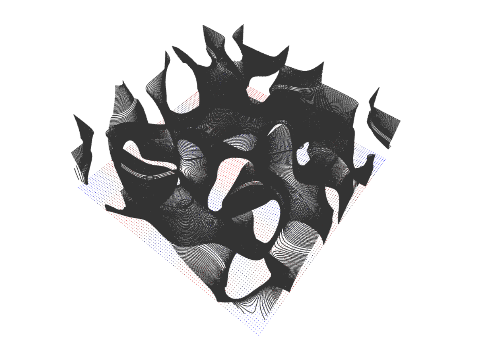
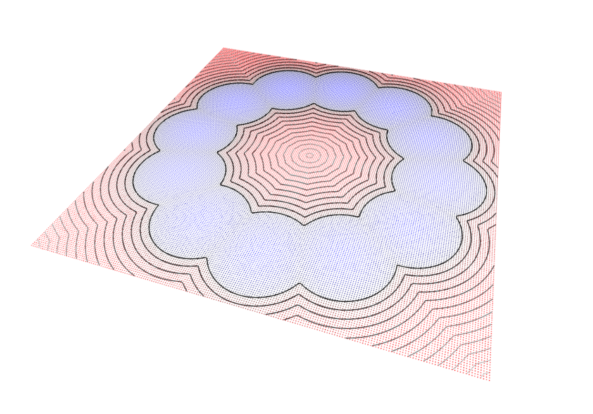
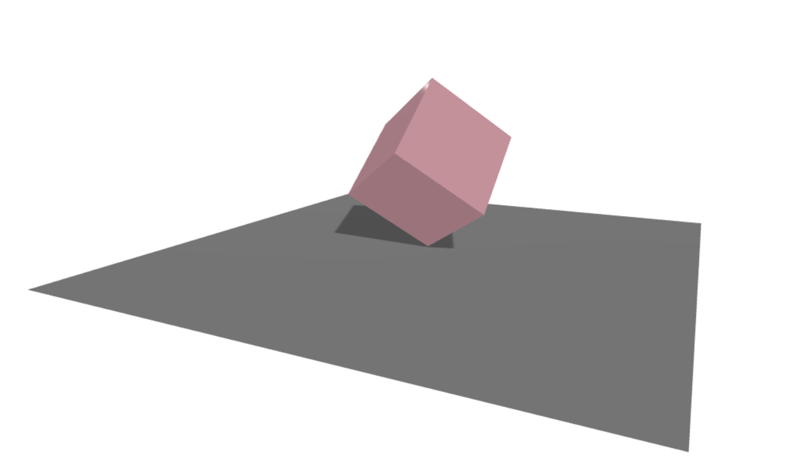

# Vibe Three.js Project

A simple Three.js project for students to learn and experiment with 3D graphics.

## Setup

1. Make sure you have [Node.js](https://nodejs.org/) installed on your computer
2. Open a terminal in this project folder
3. Run these commands:
   ```bash
   npm install
   npm start
   ```
4. Open your browser and go to `http://localhost:5173`

## Project Structure

- `index.html` - The main HTML file
- `main.js` - Core Three.js setup (don't modify this)
- `sketches/` - Directory containing your 3D sketches
  - `example.js` - Example sketch with a rotating cube
- `package.json` - Project configuration and dependencies

## How to Create Your Own Sketch

1. Create a new file in the `sketches` folder (e.g., `mySketch.js`)
2. Copy this template:
   ```javascript
   import * as THREE from 'three';

   export function setup(scene, camera) {
       // Create your 3D objects here
       // Return any objects you want to animate
       return { /* your objects */ };
   }

   export function update(objects) {
       // Animate your objects here
   }
   ```
3. To use your sketch, modify the import in `main.js`:
   ```javascript
   import { setup, update } from './sketches/mySketch.js';
   ```

## Example Modifications

Try these simple changes in your sketch:
- Change colors: Modify the `color` value in materials
- Change positions: Modify object positions using `position.set(x, y, z)`
- Add more objects: Create new geometries and add them to the scene
- Change animations: Modify the `update` function

## Dependencies

- Three.js - For 3D graphics
- Vite - For development server and live reloading

## Example Visualizations

### Minimal Surfaces

*Visualization of minimal surfaces with stacked contours*

### Signed Distance Fields

*Signed Distance Field visualization with contour lines*

### Mesh Example

*Basic mesh cube visualization* 