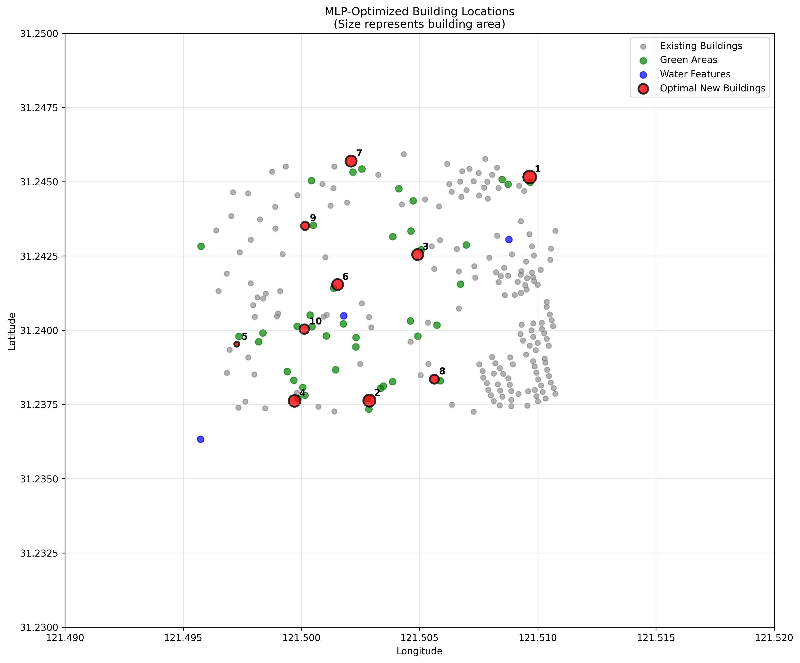

4. **Results Analysis**: Check the generated outputs:
   - `data/MLP_Building_Results/` - Optimal building coordinates and parameters
   - `data/optimization_history/` - Optimization scores and iteration progress
   - Generated visualizations showing heatmaps and final placements# Geospatial Data Analysis with MLP

A machine learning project that analyzes geospatial data (buildings, roads, water, green spaces) using Multi-Layer Perceptron to predict optimal building locations.

## Setup

1. Make sure you have [Python](https://www.python.org/) installed on your computer (Python 3.8+ recommended)
2. Clone this repository or download the project files
3. Open a terminal in this project folder
4. Install dependencies:
   ```bash
   pip install -r requirements.txt
   ```
   Or if you prefer using conda:
   ```bash
   conda install --file requirements.txt
   ```

## Project Structure

- `assets/` - Visual outputs and documentation
  - `iterative_optimization_animation.gif` - Animation showing optimization process
  - `optimal_locations_map.png` - Final optimized location results
- `data/` - Input Excel files and model outputs
  - `building/` - Building data Excel files
  - `green/` - Green space data Excel files  
  - `road/` - Road network data Excel files
  - `water/` - Water bodies data Excel files
  - `MLP_Building_Results/` - Neural network prediction outputs (generated)
  - `optimization_history/` - Training history and metrics (generated)
- `sketches/` - Development and experimental code
  - `data download/` - Scripts for data acquisition
  - `MLP_Module/` - Machine Learning Pipeline modules
- `requirements.txt` - Python package dependencies

## How to Use This Project

1. **Data Collection**: Use scripts in `sketches/data download/` to download Excel files containing geospatial data
2. **Data Organization**: Place the downloaded Excel files in their respective folders:
   - Building data → `data/building/`
   - Green space data → `data/green/`
   - Road data → `data/road/`
   - Water data → `data/water/`
3. **Model Training & Optimization**: Run the MLP module from `sketches/MLP_Module/`
   - The module reads Excel files from all data folders
   - Trains the MLP model on existing geospatial relationships
   - Performs iterative optimization to find optimal building locations
   - Generates results with coordinate precision and optimization scores

## Key Features

- **Multi-layer Perceptron (MLP)** for building location optimization
- **Geospatial data integration** analyzing buildings, roads, green areas, and water features
- **Iterative refinement process** with optimization score tracking
- **Heatmap visualization** showing optimization landscapes
- **Coordinate-based mapping** with latitude/longitude precision
- **Size-aware building placement** where marker size represents building area

## Example Results

### Optimization Process

*Iterative refinement progress showing how building positions are optimized over time with heatmap visualization*

### Final Optimal Locations

*MLP-optimized building locations showing the relationship between existing infrastructure (buildings, green areas, water) and recommended new building placements*

## Dependencies

This project requires the following Python packages (see `requirements.txt`):

- **pandas** - For Excel file reading and data manipulation
- **numpy** - For numerical computations
- **matplotlib** - For data visualization and plotting
- **scikit-learn** - For machine learning algorithms and MLP implementation

## Getting Started

1. Install dependencies as described in the Setup section
2. Use the data download scripts to collect your geospatial Excel files
3. Organize the Excel files in the appropriate data subfolders
4. Run the MLP module to train the model and generate predictions
5. Check the generated results in `MLP_Building_Results` and `optimization_history` folders
6. Visualize results using the generated plots and maps

## Contributing

Feel free to fork this project and submit pull requests for improvements or bug fixes.

## License

[Add your preferred license here]